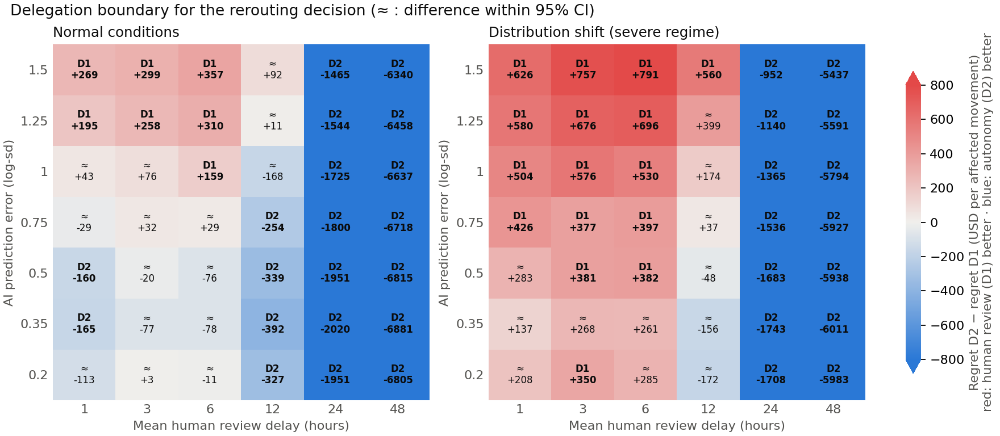
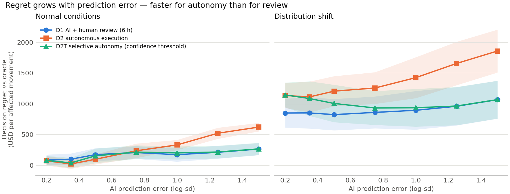
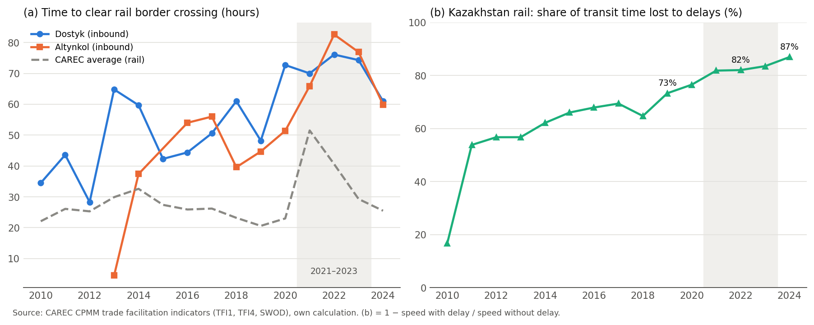

# When should AI decide? A starter simulation of AI delegation in Middle Corridor freight

Starter model for the PhD project *Delegating Freight Decisions to AI under Uncertainty:
Human Review, Decision Latency and Reversibility* (Almas Assylbekov).

It is a small **discrete-event simulation** of block trains moving through a bounded Kazakh
segment of the Trans-Caspian International Transport Route (Middle Corridor). The model
compares **who holds decision authority** over one recurrent operational decision:

> The Aktau ferry terminal is disrupted. Should an approaching train **continue** to Aktau,
> **reroute** to Kuryk, or **wait** at the junction for better information?

The model is written in plain Python + numpy, with its own small event engine, so it runs anywhere.

> **All parameter values are illustrative placeholders.** The model shows the *mechanisms*
> and the *experimental design*. Calibration with Middle Corridor data is part of the PhD.

## Decision architectures

| Code | Decision authority |
|---|---|
| **D0** | Predefined rule, no prediction-dependent adaptation (always continue) |
| **D1** | AI recommendation → human review → execution |
| **D2** | AI decision executed immediately, no routine human review |
| **D2T** | Selective autonomy: D2 when the AI's own uncertainty ≤ θ, otherwise D1 |
| **ORACLE** | Benchmark with perfect knowledge of the closure end and zero latency |

**Decision regret** is an architecture's total cost minus the ORACLE's total cost. It is computed
with **common random numbers**: identical trains, disruptions and error draws across
architectures. It is reported per affected movement.

## Mechanisms and research questions

| Mechanism | How it is represented | RQ |
|---|---|---|
| Prediction quality | Log-normal error on remaining closure time; case difficulty σᵢ; bias; distribution shift (longer closures and an AI that underestimates them) | RQ1 |
| Information arrival | Prediction error shrinks as time passes after the alert, so waiting buys information | RQ2 |
| Human review effectiveness | The reviewer has an own estimate (error `human_sigma`) and is **anchored** on the AI (`anchoring`, stronger under shift = automation bias). The reviewer can both *catch* wrong recommendations and *falsely override* correct ones. Both rates come out of the model; they are not inputs | RQ2 |
| Decision latency | Review delay ~ Exp(`review_mean_h`). If the review is not finished before the junction (commitment window τ), the train holds, or proceeds on the default route | RQ2 |
| Reversibility | A reroute committed before the junction can be undone there. The cost is `reversal_cost_fixed + reversal_cost_per_h × time since commitment` | RQ2 |
| Delegation boundary | Grid over prediction error × review delay × regime. The selective policy D2T is parameterised by θ | RQ3 |

Network: inland origin → decision point P → (τ = 12 h) → junction J → Aktau (6 h) or Kuryk
(10 h) → ferry queue (Aktau every 5 h; Kuryk every 8 h) → crossing to Alat (20 h). Closures hit
Aktau. 30% of them are weather events that also close Kuryk.

## Run

```bash
pip install -r requirements.txt
python tests.py                    # sanity checks
python run_experiments.py --quick  # ~20 s
python run_experiments.py          # full grid, 10 replications, ~2 min
```

Outputs go to a `results/` folder, which the script creates. The figures shown below are included in the repository.

## First (illustrative) results





What the starter model already shows. These are hypotheses to test with calibrated data, not findings.

1. **There is a delegation boundary.** Autonomy (D2) is preferable when predictions are good or
   when review is slow. Review (D1) pays off when predictions are poor *and* review is fast.
2. **Distribution shift moves the boundary towards review.** In the severe regime, review adds
   value even for an AI that is accurate under normal conditions. The AI's bias is invisible
   to its own confidence measure.
3. **Latency effects are non-monotone.** A moderate review delay (3–6 h) can beat a very fast
   one (1 h), because information arrives while the reviewer deliberates. Beyond the commitment
   window (≥ 24 h), the cost of delay dominates.
4. **Confidence-based selective autonomy (D2T) does not detect shift.** Its threshold relies
   on the AI's own uncertainty, which stays calibrated to the old regime.
5. **Reviewers err in both directions.** In the baseline, reviewers catch about half of the wrong
   recommendations and falsely override about 4–5% of the correct ones. Under shift the catch
   rate falls to about 37%, because anchoring on the AI increases.

## Key parameters (`model.Params`)

`sigma_base`, `bias`, `distribution_shift`, `shift_bias`, `info_gain_per_h`,
`review_mean_h`, `human_sigma`, `anchoring`, `anchoring_under_shift`, `override_margin`,
`late_review`, `tau_h`, `reversal_cost_*`, `theta`, `reroute_cost`, `holding_per_h`,
`late_penalty_per_h`, and the terminal headways and capacities.

## Calibration plan (PhD Year 1)

- Closure frequency and duration: port notices, Caspian ferry schedules and AIS vessel movements for Aktau/Kuryk ferries, and wind/wave reanalysis data.
- Rail transit and yard dwell times: public statistics and industry partners.
- Costs (holding, rebooking, customs re-documentation, late delivery): expert interviews with forwarders and operators.
- Review delay and reviewer error: interviews and a vignette experiment with dispatchers.

## Limitations and next steps

- Queue-based cost estimates are myopic. They ignore the externality of many simultaneous reroutes, which the DES itself does capture.
- One disruption type at one terminal. Next: weather fields that affect both ports, and border/yard congestion.
- θ in D2T is not optimised yet. Next: search over threshold policies (θ, τ) to map the optimal delegation boundary.
- A stylised analytical model (optimal stopping) to derive propositions that the DES then tests.

## Public data: CPMM indicators

`cpmm_explore.py` gives a first look at the CAREC Corridor Performance Measurement and Monitoring (CPMM)
trade facilitation indicators for Kazakhstan rail, 2010-2024. Download the country and border-crossing-point
CSV files from https://cpmm.carecprogram.org/data/ into the same folder and run `python cpmm_explore.py`.



Rail border-crossing times at Dostyk and Altynkol rose from about 45-48 hours (2019) to 76-83 hours (2022)
and fell to about 60 hours (2024). Delays have made up more than 80% of rail transit time since 2021. This
is an observed regime shift of the kind the model studies as "distribution shift".

## Licence and acknowledgements

MIT licence (see `LICENSE`). Author: Almas Assylbekov. The code was developed with the help of an AI coding
assistant. Model design, assumptions and interpretation are the author's responsibility.
